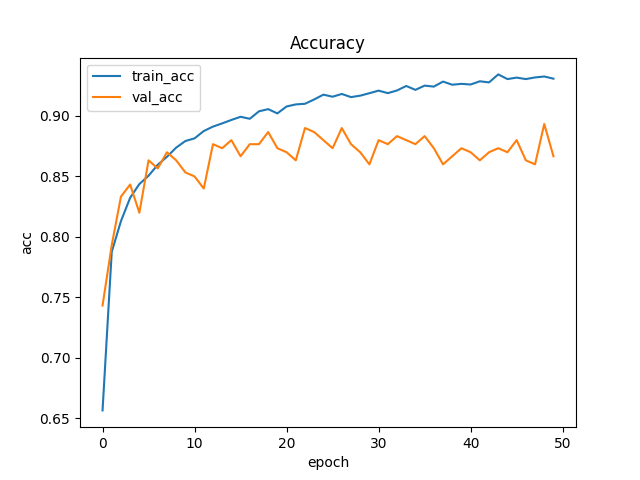
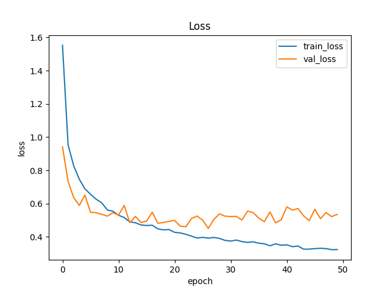

# NYCU Visual Recognitionusing Deep Learning 2025 Spring LAB 1
StudentID: 110550130<br>
Name: 劉秉驊<br>
## Introduction

This is source code that fine-tunes resnext101_32x8d.fb_swsl_ig1b_ft_in1k.<br>
Aim to classify 100 kinds of plant images.<br>

## How to install
1. Google colab<br>
    1. I use L4 GPU to train model.
    1. Just run all.

1. Run locally<br>
    1. Import env.yml in conda first.
    1. I use command gdown to download dataset. If you receive error from it, execute ```pip3 install gdown``` in virtual enviroment.
    1. Don't execute 2 blocks in source file (src/110550130.ipynb):
        1. **Setting Up Your Python Environment**:<br>
        All the package is contained in env.yml
        1. **IF USE GOOGLE COLAB**:<br>
         This is used to download files when using colab.
    1. Move to project directory
    1. Then just run all.

## Performance snapshot
1. If you execute without modifying anything, you should get the results as below:<br>

