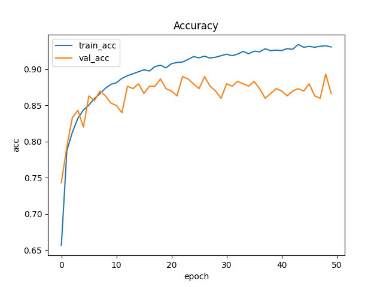
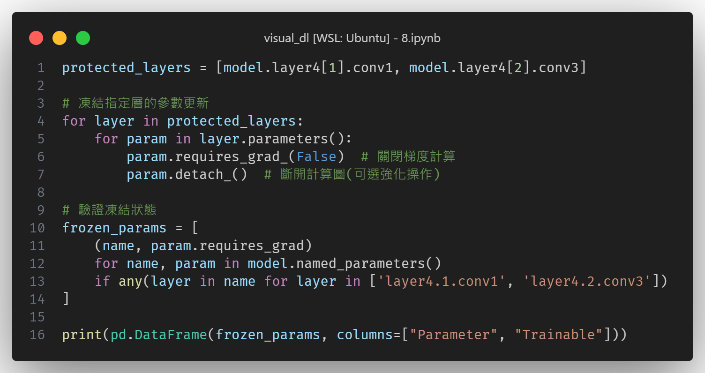

# Visual Recognitionusing Deep Learning
## Lab1 report
### 110550130 劉秉驊

### My github
1. https://github.com/Potato-TW/visual_dl/tree/main

### Introduction

In this homework, we use resnext101_32x8d.fb_swsl_ig1b_ft_in1k with pre-trained weights from timm to classify 100 kinds of plants. 

We implement several methods to raise accuracy and suppress loss on valid like adjustment of hyperparameters, different transformation of images, and even freezing layers in model. 

We hope our fine-tuned model can reach higher performance than official training. 

### Method

1. Choosing model 
Our model is resnext101_32x8d.fb_swsl_ig1b_ft_in1k. 
In timm leaderboard of image classification, this model gets 90% in top-5 accuracy with only 88M parameters. 
It's really powerful. 

1. Image transformation 
Here is model configure. Model takes $224 * 224$ images as input.  
 
Then we implement several motheds on training data, but only crop validation data in center to $224 * 224$: 
    1. Random crop $224 * 224$
    1. Horizonal, vertical flip
    1. Rotation 30 degree
    1. Gaussian blurring

2. Hyperparameter
    1. batch size: 96 (training on 24G vram of L4 GPU)
    1. learning rate: 0.003
    1. epochs: 50
    

### Results
1. After training, we can see the trend of accuracy and loss below. 
When in $48^{th}$ epoch, we get the lowest loss 0.155 on training and 0.543 on validation, and meanwhile we get 0.88 of accuracy on validation. 
Finally, we obtain 0.94 of accuracy on test case. 

1. At the same time, we also capture the $49^{th}$ epoch of highest accuracy. 
0.153 on training loss 
0.552 on validation loss 
0.887 on validation accuracy  
As the result, on test case, we surprisingly get as the same score as we choose lowest loss.  
We think the performance of lowest loss and highest accuracy is the same, which even they have different accuracy on validation data.

### Additional experiments
1. Freeze sensitive layers 
First we need to define sensitive layers. 
We use validation data to compute the loss of each layer in the original model. 

We freeze the top 2 sensitive layers, expecting this model can keep the capibility of learning images. 
Don't be easily affected by training data. 

We can se the result below. 
Accuracy and loss move up then down sharply. But this model can still reach nice accuracy compared with non freezed model, and it even tries to reach lower loss. 

We can say this freeze method gets better results than we think. 

1. Set large learning rate on sensitive layers 
Opposite to freezing method, instead of just freezing layers, we set higher learning rate on those layers, hoping they can learn faster than insensitive layers. 

    | sensitive layer | Top 1 | Top 2  |
    |-----------------|-------|--------|
    | learning rate   | 0.003 | 0.0008 |
    | weight decay    | 0.005 | 0.007  |

     
As we can see the result, There is no sharp up and down compared with freeze layers. 
However, it loses its potential to get higher accuracy, which both oscillate around that seems to overfit. 

### References
1. [Code template](https://github.com/cj-mills/pytorch-timm-gesture-recognition-tutorial-code)

1. [Billion-scale semi-supervised learning for image classification](https://arxiv.org/abs/1905.00546)

1. [Aggregated Residual Transformations for Deep Neural Networks](https://arxiv.org/abs/1611.05431)

1. [Deep Residual Learning for Image Recognition](https://arxiv.org/abs/1512.03385)

