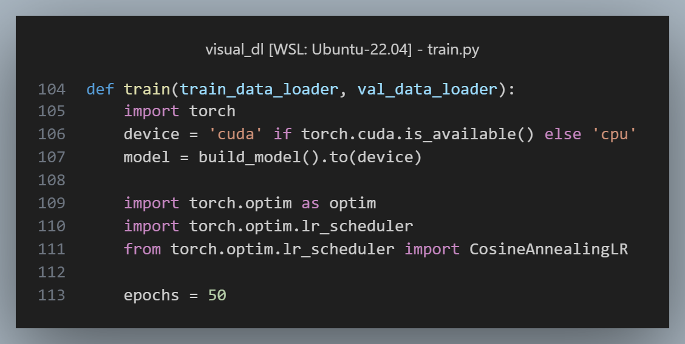
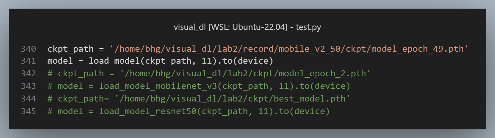
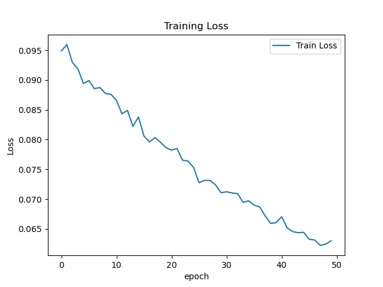

# NYCU Visual Recognitionusing Deep Learning 2025 Spring LAB 2

StudentID: 110550130<br>
Name: 劉秉驊<br>

## Introduction

In this lab, we implement Fast RCNN with different backbones to recognize digits in images.<br>

## How to install
1. Google colab<br>
    1. I use A100 GPU to train model.
    1. Run all.

1. Run locally<br>
    1. Import env.yml in conda first.

To change model settings:<br>
1. train.py<br>
We provide 3 backbones:<br>
    ```python
    # MobileNet v2
    def build_model(num_classes=11):
        ...
    # MobileNet v3
    def build_model_v3(num_classes=11):
        ...
    # ResNet 50
    def build_model_resnet50(num_classes=11):
        ...
    ```

    Don't forget to change model variable here.<br>
    And change epochs as hyperparameter.<br>

    

    We also provide several optimizer / scheduler combination.<br>

    ```python
    def first_version_v2(model):
        ...

    def gpt_recommend_v2_speedup(model, train_data_loader):
        ... 

    def reference_optim_scheduler(model):
        ...

    def v2_reconstrust(model):
        ...

    optimizer, lr_scheduler = first_version_v2(model)
    # optimizer, lr_scheduler = gpt_recommend_v2_speedup(model, train_data_loader)
    # optimizer, lr_scheduler = reference_optim_scheduler(model)
    ```

1. test.py<br>
You need to change model backbone to load model weights.<br><br>
For example, if we use MobileNet v2 to train, we need to change to 
    ```python 
    model = load_model(ckpt_path, 11).to(device) 
    ```
    


## Performance snapshot
We use MobileNet v2 to recognize digits.<br>
And if you use AdamW + Cosine Annealing LR as well, you can probabiliy get the below result.<br>

But we don't guarantee the results of the other settings.<br>

