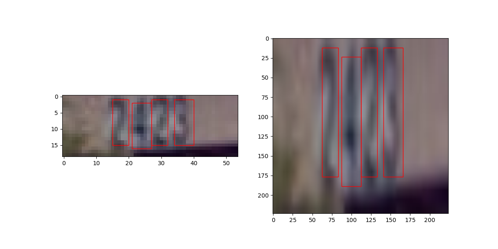

# Visual Recognitionusing Deep Learning
## Lab2 report
### 110550130 劉秉驊

### My github
1. https://github.com/Potato-TW/visual_dl/tree/main

### Introduction

In this lab, we implement Fast RCNN with different backbones to recognize digits in images.<br>


### Method

1. Loading data<br>
For dataset, we extract image ID, bbox, and category ID as the dictionary $target$, and collect images to become one batch.<br>
```python
class DigitDataset(Dataset):
    def __init__(self, root, annotation_path, transforms=None):
        with open(annotation_path) as f:
            self.coco_data = json.load(f)
        self.root = root
        self.transforms = transforms
        self.image_info = {i['id']: i for i in self.coco_data['images']}
        self.annotations = self._load_annotations()

    def _load_annotations(self):
        ann_dict = {}
        for ann in self.coco_data['annotations']:
            image_id = ann['image_id']
            if image_id not in ann_dict:
                ann_dict[image_id] = []
            ann_dict[image_id].append({
                'bbox': ann['bbox'],
                'category_id': ann['category_id'],
            })
        return ann_dict
```

While loading each image and its annotation, we apply resizing transformation defined by ourselves.<br>
The transformation only makes images and their corresponding boxes resize to 224, and also turn boxes formattion from xywh to xyxy fed into model.<br>
At final, images need normalized and turned into tensor data type, which is implemented by self.transforms.<br>

```python
    def __getitem__(self, idx):
        image_id = list(self.image_info.keys())[idx]
        img_path = f"{self.root}/{self.image_info[image_id]['file_name']}"
        image = Image.open(img_path)
        

        target = {}
        target['boxes'] = torch.as_tensor(
            [ann['bbox'] for ann in self.annotations[image_id]], 
            dtype=torch.float32
        )
        target['labels'] = torch.as_tensor(
            [ann['category_id'] for ann in self.annotations[image_id]], 
            dtype=torch.int64
        )
        target['image_id'] = torch.tensor([image_id])

        image, target = ResizeWithBox((224, 224))(image, target)        # If need to validate transformation, comment this row
        
        if self.transforms:
            image = self.transforms(image)
            
        return image, target
        

    def __len__(self):
        return len(self.image_info)
```

This is how to resize image and targets (boxes).<br>

```python
class ResizeWithBox(object):
    def __init__(self, size=(224, 224)):
        self.size = size  # (height, width)
    
    def __call__(self, image, target):
        if isinstance(image, Image.Image):
            orig_w, orig_h = image.size
        else:
            orig_h, orig_w = image.shape[1], image.shape[2]
        
        # print(f'Original size: {orig_w}x{orig_h}')
        
        scale_w = self.size[1] / orig_w
        scale_h = self.size[0] / orig_h
        
        resized_image = F.resize(image, self.size)
        
        # print(f'Resized size: {resized_image}')
        
        # (COCO: [x, y, w, h])
        boxes = target['boxes'].clone()
        
        # print(f'Original boxes: {boxes}')
        if boxes.numel() > 0:
            boxes[:, 0] *= scale_w  # x
            boxes[:, 1] *= scale_h  # y
            boxes[:, 2] *= scale_w  # w
            boxes[:, 3] *= scale_h  # h
            
        # print(f'Resized boxes: {boxes}')
        
        from torchvision.ops import box_convert
        boxes = box_convert(boxes, in_fmt='xywh', out_fmt='xyxy')
        
        target['boxes'] = boxes
        return resized_image, target
```


1. Training<br>
For model, we use MobileNet v2 as model backbone, and use default settings of anchor.<br>
In dataset, we have 10 classes of digits to recognize, so thus we have to reserve one more class as background, totally 11 classes.<br>

```python
def build_model(num_classes=11):
    weights = torchvision.models.MobileNet_V2_Weights.DEFAULT
    backbone = torchvision.models.mobilenet_v2(weights=weights).features
    backbone.out_channels = 1280

    anchor_generator = AnchorGenerator(
        sizes=((32, 64, 128, 256, 512),),
        aspect_ratios=((0.5, 1.0, 2.0),) * 5
    )

    model = FasterRCNN(
        backbone,
        num_classes=num_classes,
        rpn_anchor_generator=anchor_generator,
        box_score_thresh=0.8
    )
    
    return model
```

For hyperparameters:<br>
1. Optimizer: AdamW
    1. Learning rate: 0.001
1. Scheduler: Cosine Annealing LR
1. Epoch: 50

```python
def first_version_v2(model):
    optimizer = optim.AdamW(
        model.parameters(),
        lr=1e-3,
        eps=1e-08
    )

    lr_scheduler = CosineAnnealingLR(
        optimizer,
        T_max=epochs*0.6,     
        eta_min=1e-6         
    )

    return optimizer, lr_scheduler
```

For each epoch<br>
1. Extract batches from loader
1. Feed images, targets (boxes) in model to train
1. Update loss, optimizer, and scheduler
1. Record evaluate metrics

```python
train_loss_list = []
for epoch in tqdm(range(epochs), desc="Epochs"):
    model.train()
    
    train_loss_iter = []
    bar = tqdm(train_data_loader, desc="Training", leave=False)
    for images, targets in train_data_loader:
        images = [img.to(device) for img in images]  
        targets = [{k: v.to(device) for k,v in t.items()} for t in targets]

        loss_dict = model(images, targets)
        losses = sum(loss for loss in loss_dict.values())
        
        optimizer.zero_grad()
        optimizer.step()
        lr_scheduler.step()

        train_loss_iter.append(losses.detach().cpu().item())

        bar.set_postfix(loss=losses.detach().cpu().item() / len(train_data_loader))
        bar.update()
        
    mean_epoch_train_loss = np.mean(train_loss_iter)
    train_loss_list.append(mean_epoch_train_loss)
    bar.close()


    metrics['train_loss'].append(mean_epoch_train_loss)
    
    
    val_metrics = evaluate(model, val_data_loader, device)
    metrics['val_accuracy'].append(val_metrics['accuracy'])
    metrics['val_recall'].append(val_metrics['recall'])
    
    
    current_map = (val_metrics['accuracy'] + val_metrics['recall']) / 2
    if current_map > metrics['best_map']:
        torch.save(model.state_dict(), f"ckpt/best_model.pth")
        metrics['best_map'] = current_map
    
    
    print(f"Epoch {epoch+1}/{epochs} | "
            f"Train Loss: {metrics['train_loss'][-1]:.4f} | "
            f"Val Acc: {val_metrics['accuracy']:.2%} | "
            f"Val Recall: {val_metrics['recall']:.2%}")

    
    torch.save(model.state_dict(), f"ckpt/model_epoch_{epoch}.pth")
```

For evaluation, 待施工
!!!!!!!!!!!1!!!!!!!!!!!!!1

```python
def evaluate(model, data_loader, device, iou_threshold=0.5):
    model.eval()
    results = defaultdict(list)
    
    with torch.no_grad():
        for images, targets in tqdm(data_loader, desc="Evaluating", leave=False):
            images = [img.to(device) for img in images]
            
            # with autocast(device_type='cuda' if 'cuda' in device else 'cpu'):
            predictions = model(images)
            
            for pred, true in zip(predictions, targets):
                true_boxes = true['boxes'].to(device)
                true_labels = true['labels'].to(device)
                
                iou_matrix = box_iou(pred['boxes'], true_boxes)
                
                matched_true = set()
                for det_idx in range(len(pred['boxes'])):
                    if len(iou_matrix[det_idx]) == 0:
                        continue
                    
                    best_true_idx = iou_matrix[det_idx].argmax()
                    if iou_matrix[det_idx][best_true_idx] >= iou_threshold:
                        if best_true_idx not in matched_true:
                            results['pred_labels'].append(pred['labels'][det_idx].item())
                            results['true_labels'].append(true_labels[best_true_idx].item())
                            matched_true.add(best_true_idx)
                
                for true_idx in range(len(true_boxes)):
                    if true_idx not in matched_true:
                        results['pred_labels'].append(-1) 
                        results['true_labels'].append(true_labels[true_idx].item())
    
    pred_labels = np.array(results['pred_labels'])
    true_labels = np.array(results['true_labels'])
    
    valid_mask = pred_labels != -1
    accuracy = np.mean(pred_labels[valid_mask] == true_labels[valid_mask]) if any(valid_mask) else 0
    
    recall = len(matched_true) / len(true_labels) if len(true_labels) > 0 else 0
    
    return {
        'accuracy': accuracy,
        'recall': recall,
        'matched_samples': len(matched_true),
        'total_samples': len(true_labels)
    }
```

For testing data, it's almost similar to how to load training data.<br>
The only different thing is testing data has no annotation to load in, which we can just use torch built-in compose to resize images.<br>

```python
class TestDataset(Dataset):
    def __init__(self, root, annotation_path=None, transforms=None):
        self.root = root
        self.transforms = transforms
        
        self.image_info = self._scan_directory()
    
    def _scan_directory(self):
        import re 
        
        image_files = [f for f in os.listdir(self.root) 
                      if f.lower().endswith(('png', 'jpg', 'jpeg'))]
        
        image_info = {}
        for f in sorted(image_files):
            match = re.search(r'^(\d+)', f)
            if match:
                img_id = int(match.group(1))
                image_info[img_id] = {'id': img_id, 'file_name': f}

        
        return image_info

    def __getitem__(self, idx):
        image_id = list(self.image_info.keys())[idx]
        img_path = f"{self.root}/{self.image_info[image_id]['file_name']}"
        
        image = Image.open(img_path).convert('RGB')
        
        transform_chain = T.Compose([
            T.Resize((224, 224)),      
            T.ToTensor(),              
            T.Normalize(               
                mean=[0.485, 0.456, 0.406],
                std=[0.229, 0.224, 0.225]
            )
        ])
        
        image_tensor = transform_chain(image)
        
        return image_tensor, {'image_id': torch.tensor([image_id])}

    def __len__(self):
        return len(self.image_info)
    
    def get_info(self):
        return self.image_info
```

Loading checkpoint model.<br>

Like evaluation, model evaluating mode, feed images, and generate task 1 json file, task 2 csv file.<br>

```python
def test(model, test_data_loader):
    model.eval()
    
    device = 'cuda' if torch.cuda.is_available() else 'cpu'
    
    task1 = []
    

    content = {
        "image_id": range(1, 13069),
        "pred_label": -1  
    }

    import pandas as pd

    task2 = pd.DataFrame(content)
    
    test_bar = tqdm(test_data_loader, desc="Test", leave=False)
    with torch.no_grad():
        for images, images_id in test_data_loader:
            images = images.to(device)

            tmp = model(images)
            # print(tmp)
            
            coco = convert_to_coco_format(tmp, images_id['image_id'], score_threshold=0.8)
            
            task1 = task1 + coco
            
            task2 = task2_do(tmp, images_id['image_id'], task2, score_threshold=0.8)
            
            test_bar.update()
    test_bar.close()
    
    with open('./result/task1/pred.json', 'w') as f:
        json.dump(task1, f, indent=4)
        
    task2.to_csv('./result/task2/pred.csv', index=False)
```

In task 1, model will output boxes, category.<br>
We need to de-normalize boxes back to original size and position.<br>
Denormalization is mentioned in the next section.<br>

```python
def convert_to_coco_format(outputs, image_ids, score_threshold=0.8):
    coco_results = []
    
    for img_id, detections in zip(image_ids, outputs):
        boxes = detections['boxes'].cpu().detach()#.numpy()  # (N,4) tensor -> numpy
        scores = detections['scores'].cpu().detach().numpy().astype(float)  # (N,)
        labels = detections['labels'].cpu().detach().numpy().astype(int)  # (N,)
        
        if boxes.shape[0] == 0:
            print(f'img_id: {img_id} no boxes')
            # continue
        
        for i in range(boxes.shape[0]):
            # if scores[i] < score_threshold:
            #     continue
                
            # from torchvision.ops import box_convert
            # new_box = box_convert(boxes[i], in_fmt='xyxy', out_fmt='xywh')
            new_box = deNormalize_box(img_id, boxes[i])
                
            # (x1,y1,x2,y2) -> (x,y,width,height)
            # x1, y1, x2, y2 = boxes[i].tolist()
            # w = x2 - x1
            # h = y2 - y1
            
            output_dict = {
                "image_id": int(img_id.item()), 
                "bbox": new_box,
                "score": float(scores[i]),
                "category_id": int(labels[i]),
            }
            
            coco_results.append(output_dict)
    
    return coco_results
```

We reload original images again to compare scale between outputs of model (normalized) and them (non-normalized).<br>
Convert xyxy back to xywh.<br>
Then we get original size box.<br>

```python
def deNormalize_box(image_id, xyxy_box):
    new_w, new_h = 224, 224
    
    from PIL import Image
    orig_img = Image.open(f'./dataset/test/{int(image_id.item())}.png')
    orig_w, orig_h = orig_img.size
    
    from torchvision.ops import box_convert
    xywh_box = box_convert(xyxy_box, in_fmt='xyxy', out_fmt='xywh')
    
    xywh_box = xywh_box.tolist()
    
    scale_w = orig_w / new_w
    scale_h = orig_h / new_h
    
    x, y, w, h = xywh_box
    orig_x = x * scale_w
    orig_y = y * scale_h
    orig_w = w * scale_w
    orig_h = h * scale_h  
    
    orig_box = [orig_x, orig_y, orig_w, orig_h]
    
    # print(f'orig box: {orig_box}')
    
    return orig_box
```

In task 2, we basically construct from task 1 that we make the leftmost box as the first digit and generate the number of those boxes consist.<br>

```python
def task2_do(outputs, image_ids, task2, score_threshold=0.8):
    import numpy as np
    # print(f'coco: {coco}')
    
    for img_id, detections in zip(image_ids, outputs):
        img_id = img_id.item()
        # print(f'img_id: {type(img_id), img_id}')
        boxes = detections['boxes'].cpu().detach().numpy()  # (N,4) tensor -> numpy
        # print(f'boxes: {boxes, boxes.shape}')
        scores = detections['scores'].cpu().detach().numpy().astype(float)  # (N,)

        
        if boxes.shape[0] == 0:
            continue
        
        labels_tmp = detections['labels'].cpu().detach().numpy().astype(int)  # (N,)    
        labels_tmp -= 1
        
        # print(f'labels_tmp: {labels_tmp}')
        
        new_boxes = []
        labels = []
        for i in range(boxes.shape[0]):
            # if scores[i] < score_threshold:
            #     continue
            new_boxes.append(boxes[i][0])
            labels.append(labels_tmp[i])
        
        
        new_boxes = np.array(new_boxes)
        labels = np.array(labels)
        
        
        sort_idx = np.argsort(new_boxes)

        # a_sorted = boxes[sort_idx]
        b_sorted = labels[sort_idx]
        
        # print(a_sorted)
        # print(b_sorted)
            
        pred = int(''.join(b_sorted.astype(str)))

        task2.loc[task2['image_id'] == img_id, 'pred_label'] = pred
        
    return task2
```

### Results

### References
1. DeepSeek R1
1. 
1. 

### Additional experiments
1. Different backbones<br>
We tried 2 other pre-trained backbones provided by pyTorch, MobileNet v3 and ResNet50.<br><br>
Including MobileNet v2 we use above, we encounter non-convergence problem on these 3 models, nevertheless training loss is low and decreasing.<br><br>
We have tried several combinations of optimizers and schedulers like:<br>
    1. AdamW + Cosine Annealing
    1. SGD + StepLR<br>

    Interestingly, when using AMP at MobileNet V2, it starts converging.<br>
    Perhaps AMP provides low enough loss updating.<br>
    And if batch size is small enough, that is 

1. AMP / GradScale with different hyperparameter strategies

