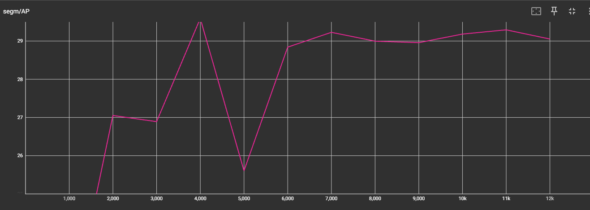

# NYCU Visual Recognitionusing Deep Learning 2025 Spring LAB 3

StudentID: 110550130<br>
Name: 劉秉驊<br>

## Introduction

In this lab, we implement Mask RCNN with different pretrain weights to solve instance segmentation task.<br>
We train our model on medical cell images of 4 classes.<br>
Evaluate prediction by COCO evaluation to reach highest average precision.<br>

## How to install
Run locally<br>
1. Import env.yml in conda first.
1. Activate conda virtual environment.
1. Please follow by official Instruction of detectron2 and download the python package.

To change model settings:<br>
Please change the model weight in config.py.<br>
You can find more models in detectron2 github repo.<br>
```python
MODEL_YAML = "COCO-InstanceSegmentation/mask_rcnn_X_101_32x8d_FPN_3x.yaml"
```

To change inference checkpoint:<br>
Please change the model weight in inference.py.<br>
```python
def setup():
    ...
    cfg.MODEL.WEIGHTS='log/model_0007999.pth'
    ...
```

## Performance snapshot

|Total training loss|Segmentation AP|
|-|-|
|||