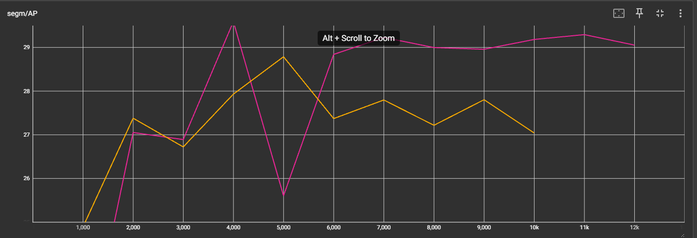

# Visual Recognitionusing Deep Learning
## Lab3 report
### 110550130 劉秉驊

### My github
1. https://github.com/Potato-TW/visual_dl/tree/main

### Introduction

In this lab, we implement Mask RCNN with different pretrain weights to solve instance segmentation task.<br>
We train our model on medical cell images of 4 classes.<br>
Evaluate prediction by COCO evaluation to reach highest average precision.<br>

### Method
We basically implement on detectron2 that is developed, maintained by Facebook.<br>
And we refer to official tutorial of detectron2.<br>

#### Dataset
We first register training data, and validation data.<br>
In this lab, we use $\frac{1}{5}$ of the whole dataset to be validation data.<br>
```python
def register_dataset(name: str, suffix: str):
    if name in DatasetCatalog.list():
        return
        
    DatasetCatalog.register(name, lambda s=suffix: get_dict(s))
    MetadataCatalog.get(name).set(
        thing_classes=[f'class{i}' for i in range(1, NUM_CLASSES+1)],
        mask_format="bitmask",
    )
def get_dict(suffix: str) -> List[Dict]:
    dirs = list((DATA_ROOT / "train").iterdir())
    random.Random(SEED).shuffle(dirs)
    end = int(len(dirs) * (1 - VAL_RATIO))
    splited_dir = dirs[:end] if suffix == "train" else dirs[end:]
    return [get_item(dir, i) for i, dir in enumerate(splited_dir)]
```

Then we first make dataset into COCO format.<br>
We load in image infomation, and the importance is annotation that we use segmentation with RLE format.<br>
For each mask file, there are several unique value representing the same class.<Br>
Then encode binary mask into bounding box.<br>
```python
def get_item(dir_path: Path, img_id: int) -> Dict:
    img_path = dir_path / "image.tif"
    img = cv2.imread(str(img_path))
    h, w = img.shape[0], img.shape[1]
    record = {
        "file_name": str(img_path),
        "image_id": img_id,
        "height": h,
        "width": w,
    }

    annos = []
    for mask_path in dir_path.glob("class*.tif"):
        m = re.search(r"class(\d+)\.tif", mask_path.name)
        class_ = int(m.group(1)) - 1
        mask = cv2.imread(str(mask_path), cv2.IMREAD_UNCHANGED)
        if mask.ndim > 2:
            mask = mask[..., 0]
        for inst_id in np.unique(mask):
            if inst_id == 0:
                continue
            bin_mask = (mask == inst_id).astype(np.uint8).copy()
            ys, xs = np.where(bin_mask)
            x0, y0, x1, y1 = xs.min(), ys.min(), xs.max(), ys.max() # xyxy
            rle = encode_mask(bin_mask)
            annos.append(
                {
                    "bbox": [int(x0), int(y0), int(x1), int(y1)],
                    "bbox_mode": BoxMode.XYXY_ABS,
                    "segmentation": rle,
                    "category_id": class_,
                    "iscrowd": 0,
                }
            )

    record["annotations"] = annos
    return record
```

#### Train
In training step, load in model file, and set training configure.<br>
Most of the settings is default settings, which use WarmupMultiStepLR and 0.0004 as initial learning rate.<br>
For 1000 iterations, evaluate the result by coco evaluator.<br>
```python
class Trainer(DefaultTrainer):
    @classmethod
    def build_evaluator(cls, cfg, dataset_name, output_folder=None):
        if output_folder is None:
            output_folder = os.path.join(cfg.OUTPUT_DIR, 'coco')
        return COCOEvaluator(dataset_name, cfg, output_dir=output_folder)


def setup(args):
    cfg=get_cfg()
    cfg.merge_from_file(model_zoo.get_config_file(MODEL_YAML))
    cfg.MODEL.WEIGHTS=model_zoo.get_checkpoint_url(MODEL_YAML)
    cfg.INPUT.MASK_FORMAT="bitmask"

    cfg.DATASETS.TRAIN=(f'{DATASET_NAME}_train',)
    cfg.DATASETS.TEST=(f'{DATASET_NAME}_val',)
    cfg.DATALOADER.NUM_WORKERS=NUM_WORKERS

    cfg.MODEL.ROI_HEADS.NUM_CLASSES=NUM_CLASSES

    cfg.SOLVER.IMS_PER_BATCH=1
    cfg.SOLVER.BASE_LR=4e-4
    cfg.SOLVER.MAX_ITER=TOTAL_ITER
    cfg.SOLVER.STEPS=(5000,)
    cfg.SOLVER.CHECKPOINT_PERIOD=1000

    cfg.INPUT.MIN_SIZE_TRAIN=(512,)
    cfg.INPUT.MAX_SIZE_TRAIN=1024
    cfg.INPUT.MIN_SIZE_TEST=0
    cfg.INPUT.MAX_SIZE_TEST=1024

    cfg.TEST.EVAL_PERIOD=1000

    cfg.OUTPUT_DIR=str(OUTPUT_DIR.resolve())
    os.makedirs(cfg.OUTPUT_DIR, exist_ok=True)

    cfg.freeze()
    default_setup(cfg, args)

    return cfg
```

#### Inference
For inference and validation, we load in original size of images.<br>
And export to coco format with xyxy of bbox.<Br>
```python
def setup():
    cfg=get_cfg()
    cfg.merge_from_file(model_zoo.get_config_file(MODEL_YAML))
    cfg.MODEL.WEIGHTS='log/model_final.pth'
    cfg.MODEL.ROI_HEADS.NUM_CLASSES=NUM_CLASSES
    cfg.INPUT.MIN_SIZE_TEST=0
    # cfg.INPUT.MAX_SIZE_TEST=1024
    cfg.freeze()
    return cfg


if __name__=='__main__':
    predictor=DefaultPredictor(setup())

    test_file_name_id = {}
    with open(DATA_ROOT/'test_image_name_to_ids.json') as f:
        for img_info in json.load(f):
            name = img_info['file_name']
            id = img_info['id']
            test_file_name_id[name] = id
        

    results=[]
    for img_path in list((DATA_ROOT/'test_release').glob('*.tif')):
        img = cv2.imread(str(img_path))
        
        output = predictor(img)['instances'].to('cpu')
        for box, mask, class_, score in zip(output.pred_boxes.tensor.numpy(),
                                            output.pred_masks.numpy(),
                                            output.pred_classes.numpy(),
                                            output.scores.numpy()):
            rle = encode_mask(mask)
            results.append({
                'image_id': int(test_file_name_id[img_path.name]),
                'bbox': box.tolist(),
                'score': float(score),
                'category_id': int(class_ + 1),
                'segmentation': rle
            })

    json_path = './test-results.json'
    with open(json_path, 'w') as f: 
        json.dump(results, f)
```

#### Hyperparameter
- Learning rate: 0.0004
- LR scheduler: WarmupMultiStepLR
- Gamma: 0.1
- Weight decay: 0.0001
- Momentum: 0.9
- Model: cascade_mask_rcnn_R_50_FPN_3x

### Results

In validation with resizing images to 512 (min size), we can get around 30 AP score.<br>
And in test, we can get around 41 AP score showing in Codebench.<br>

|Total training loss|Segmentation AP|
|-|-|
|||

### References

[Detectron2 official github](https://github.com/facebookresearch/detectron2/blob/main/README.md)

[Detectron2 Colab tutorial](https://colab.research.google.com/drive/16jcaJoc6bCFAQ96jDe2HwtXj7BMD_-m5)


### Additional experiments
#### Different models

- Red line: cascade_mask_rcnn_R_50_FPN_3x
- Yellow line: mask_rcnn_X_101_32x8d_FPN_3x

In original resnet comparision, resXnet101 is much better than resnet50.<br>
But in with cascade on mask rcnn with backbone resnet50, though 101 gets better loss, cascade resnet50 performs much better in AP on test data.<br>
Even they have similar parameter size.<br>

|Total training loss|AP|
|-|-|
|||

#### Different Max size of images

Both are cascade_mask_rcnn_R_50_FPN_3x
- Red: With max size of 1024
- Gray: With max size of 1333 (default)

Originally, I think larger images are better for model to recognize the mask. Thus we resize bigger to feed in.<br>
For both groups, we can see max size of images affects a lot on performance of loss and AP.<br>
Max size is used in Detectron2.transform.ResizeShortestEdge that resize images according to the proportion of shortest edges.<br>
In conclusion, smaller max size is better for this model.<br>

|Total training loss|AP|
|-|-|
|||

It also shows in another model that for sure the smaller max size is better for model.<br>

|Total training loss|AP|
|-|-|
|||