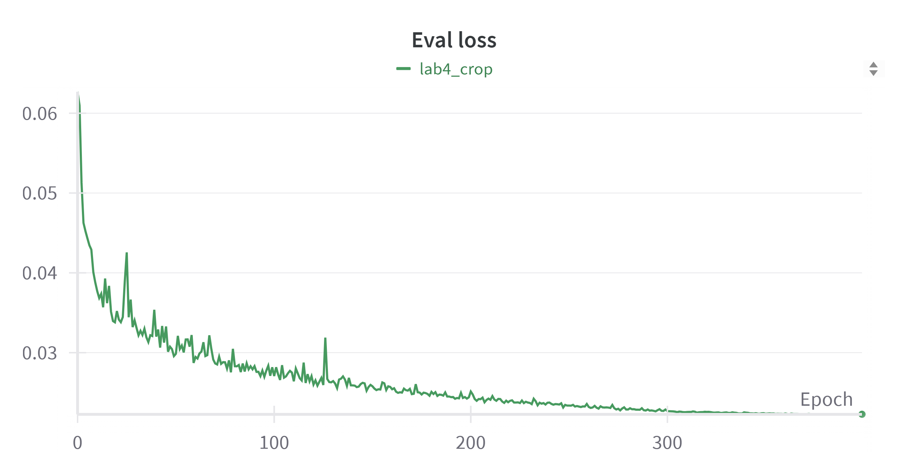

# NYCU Visual Recognitionusing Deep Learning 2025 Spring LAB 4

StudentID: 110550130<br>
Name: 劉秉驊<br>

## Introduction

In this lab, we are going to implement PromptIR to restore all-in-one blind images.<br>
We use rainy and snowy masks on training data.<br>
After 10 hours (400 epochs) training on 5070ti, we can get 30.23 PSNR on testing data.<br>

## How to install
Run locally<br>
1. Import env.yml in conda first.
```bash
conda env create -f env.yml
```
1. Activate conda virtual environment.
```bash
conda activate lab6
```

Start training epochs.<br>
```bash
python3 src/train.py
```

Start inference.<br>
```bash
python3 src/inference.py
```

Follow the parser help to change some options.<br>

## Performance snapshot

|Training loss|Evaluation loss|
|-|-|
|||