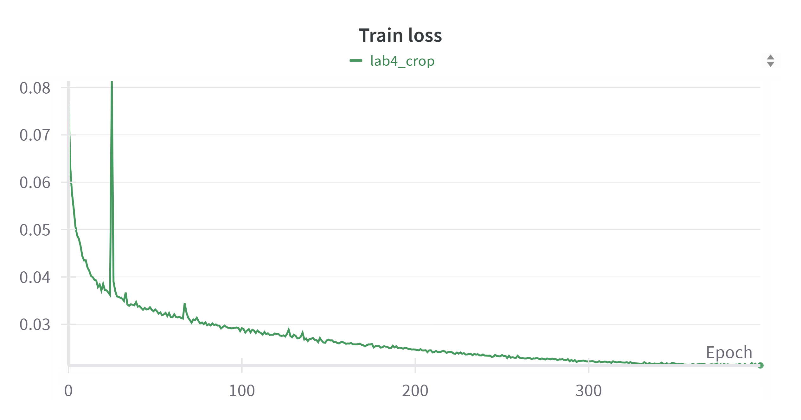
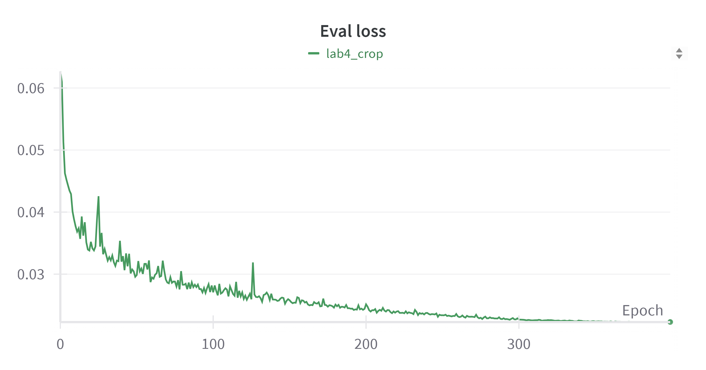
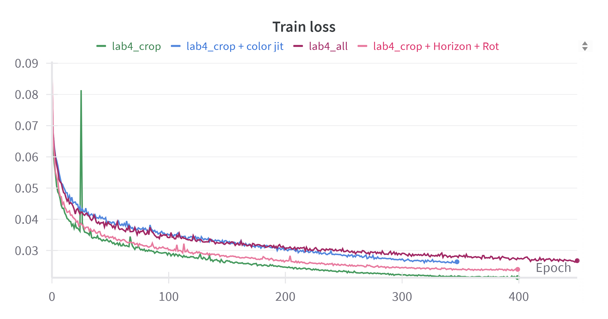
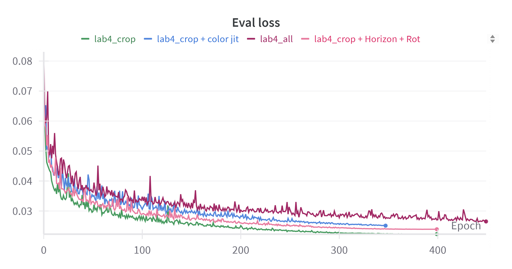
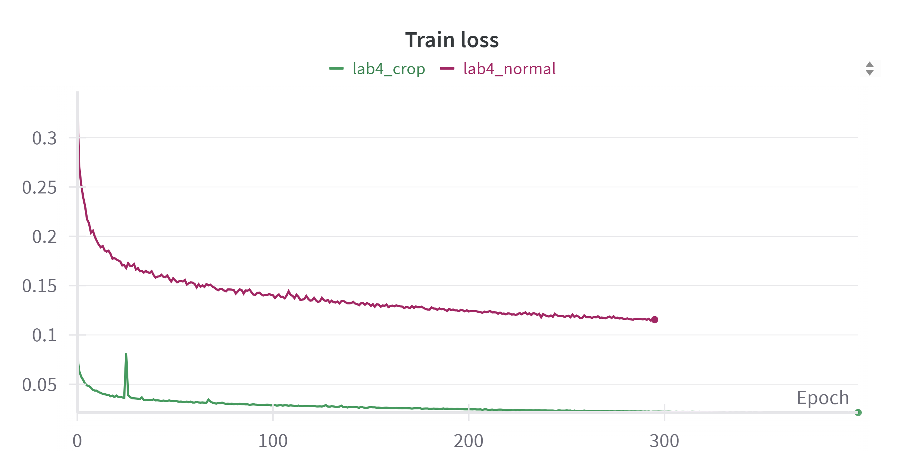
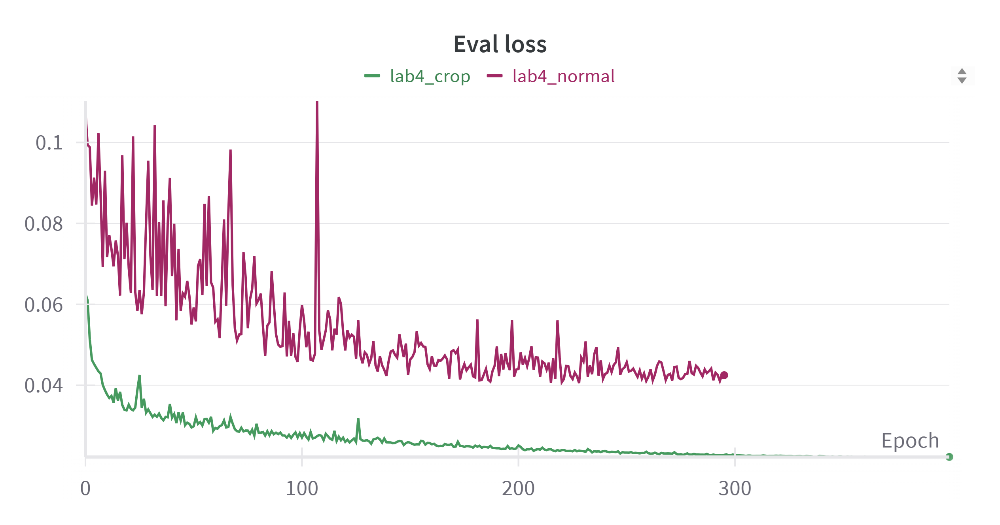

# Visual Recognitionusing Deep Learning
## Lab4 report
### 110550130 劉秉驊

### My github
1. https://github.com/Potato-TW/visual_dl/tree/main

### Introduction

In this lab, we are going to implement PromptIR to restore all-in-one blind images.<br>
We use rainy and snowy masks on training data.<br>
After 10 hours (400 epochs) training on 5070ti, we can get 30.23 PSNR on testing data.<br>

### Method
#### Dataset
For training data, we randomly pick out 20% of all data as validation data.<br>

```python
class HW4_REALSE_DATASET(Dataset):
    def get_img_list(self, img_dir: Path):
        a = sorted(img_dir.glob('*.png'))

        if self.shuffle_list is None:
            return a

        if self.mode == 'train':
            return [img for img, keep in zip(a, self.shuffle_list) if keep]
        elif self.mode == 'valid':
            return [img for img, keep in zip(a, self.shuffle_list) if not keep]
        else:
            return a
            

class Training():
    def generate_shuffle_list(self):
        random.seed(self.seed)

        total = 3200
        true_count = int(total * self.train_ratio)  # 2560
        false_count = total - true_count  # 640

        bool_list = [True] * true_count + [False] * false_count

        random.shuffle(bool_list)

        return bool_list
```

We crop $64*64$ randomly on training data, and leave validation and testing data unchanging.<Br>

```python
class HW4_REALSE_DATASET(Dataset):
    def get_trfm(self):
        if self.mode in ['train']:
            tfrm = T.Compose([
                T.RandomCrop(self.output_img_size),
                # T.RandomHorizontalFlip(p=0.5),
                # T.RandomVerticalFlip(p=0.5),
                # T.RandomRotation(30),
                # T.ColorJitter(brightness=0.2, contrast=0.5, saturation=0.3, hue=0.1),
                T.ToTensor(),
                # T.Normalize(mean=[0.485, 0.456, 0.406], std=[0.229, 0.224, 0.225])
            ])
        elif self.mode in ['valid']:
            tfrm = T.Compose([
                # T.Resize((self.output_img_size, self.output_img_size)),
                T.ToTensor(),
                # T.Normalize(mean = [0.485, 0.456, 0.406],
                #             std = [0.229, 0.224, 0.225])
            ])
        else:
            tfrm = T.Compose([
                # T.Resize((self.output_img_size, self.output_img_size)),
                T.ToTensor(),
                # T.Normalize(mean = [0.485, 0.456, 0.406],
                #             std = [0.229, 0.224, 0.225])
            ])
        
        return tfrm
```

And ensure input images and target images utilze the same tranforms in training process.<br>

```python
class HW4_REALSE_DATASET(Dataset):
    def __getitem__(self, idx):
        seed = np.random.randint(2147483647) 
        if self.mode in ['train', 'valid']:
            degraded_img_path = self.degraded_imgs[idx]
            type_, num_ = degraded_img_path.stem.split('-')

            clean_img_path = self.img_dir_path / 'clean' / f'{type_}_clean-{num_}.png'
            if clean_img_path not in self.clean_imgs:
                raise ValueError('Not found clean image')

            degraded_img = Image.open(degraded_img_path).convert('RGB')
            clean_img = Image.open(clean_img_path).convert('RGB')
            
            if self.transform:
                random.seed(seed)
                torch.manual_seed(seed)
                degraded_img = self.transform(degraded_img)
                random.seed(seed)
                torch.manual_seed(seed)
                clean_img = self.transform(clean_img)
                
            return degraded_img, clean_img
        else:
            degraded_img_path = self.degraded_imgs[idx]

            degraded_img = Image.open(degraded_img_path).convert('RGB')
            if self.transform:
                degraded_img = self.transform(degraded_img)

            img_name = degraded_img_path.stem
            return img_name, degraded_img
```

#### Model
For model structure, we refer to paper of PromptIR without any change.<br>

#### Training
In training process, we refer to settings in paper.<br>
Use AdamW, cosine annealing LR scheduler, and L1 loss.<br>
Hyperparameter is mentioned later.<br>
```python
class Training():
    def __init__(self, args):
        self.model = PromptIR(decoder=True).to(self.device)
        
        self.optimizer = torch.optim.AdamW(self.model.parameters(), lr=self.lr)
        self.lr_scheduler = torch.optim.lr_scheduler.CosineAnnealingLR(optimizer=self.optimizer,
                                                                        T_max=len(self.train_loader) * self.epochs,
                                                                        last_epoch=-1,
                                                                        eta_min=1e-9)

        self.loss_function = nn.L1Loss()
```

For every training epoch, similar to labs before, we record training loss and evaluation loss on Wandb.<br>
```python
class Training():
    @torch.no_grad()
    def eval(self, dataloader=None):
        self.model.eval()

        eval_loss = []
        progress_bar = tqdm(dataloader, desc='Eval', ncols=100)
        for img, gt in progress_bar:
            img, gt = img.to(self.device), gt.to(self.device)

            output = self.model(img)

            loss = self.loss_function(output, gt)

            eval_loss.append(loss.item())
            progress_bar.set_postfix({"loss": np.mean(eval_loss)})
            progress_bar.update()

        return np.mean(eval_loss)

    def train_one_epoch(self):
        self.model.train()
        
        train_loss = []
        progress_bar = tqdm(self.train_loader, desc=f'Training', ncols=100)
        for i, (img, gt) in enumerate(progress_bar):
            img, gt = img.to(self.device), gt.to(self.device)

            output = self.model(img)
            
            loss = self.loss_function(output, gt)
            
            self.optimizer.zero_grad()
            loss.backward()
            self.optimizer.step()
            self.lr_scheduler.step()
            
            train_loss.append(loss.item())
            progress_bar.set_postfix({'loss': np.mean(train_loss)})
            progress_bar.update()
            
        return np.mean(train_loss)

    def run(self):
        for epoch in tqdm(range(self.epochs), desc="Epochs", ncols=100):
            loss = self.train_one_epoch()
            wandb.log({
                "Epoch": epoch,
                "Train loss": loss,
            })

            eval_loss = self.eval(dataloader=self.val_loader)
            wandb.log({
                "Epoch": epoch,
                "Eval loss": eval_loss,
            })

            if epoch % self.save_frequency == 0:
                self.save_ckpt(epoch)

        self.save_ckpt(-1)
```

#### Inference
After training, we load checkpoint and feed testing images.<br>
And directly transform tensor to PIL images and save them.<br>
```python
class Tester():
    def save_img(self, img_name, output: torch.tensor):
        img_name = img_name[0]
        output = output.detach().cpu()[0]
        output = output.numpy()

        ar = np.clip(output * 255, 0, 255).astype(np.uint8).transpose(1, 2, 0)

        from PIL import Image
        pil_image = Image.fromarray(ar)

        pil_image.save(f"{self.save_img_dir}/{img_name}.png")


    @torch.no_grad()
    def test(self):
        self.model.eval()

        # eval_loss = []
        progress_bar = tqdm(self.test_loader, desc='Test', ncols=100)
        for img_name, img in progress_bar:
            img = img.to(self.device)

            output = self.model(img)

            self.save_img(img_name, output)

            progress_bar.update()
```
#### Hyperparameter
|HP|Value|
|-|-|
|lr|0.0004|
|batch size|10|
|Crop size|$64*64$|

### Results

We can see model converges starting from about $300^{th}$ epoch.<br>

|Training loss|Evaluation loss|
|-|-|
|||

### References

[1] Potlapalli, V., Zamir, S. W., Khan, S., & Khan, F. S. (2023, June 22). ProMpTIR: Prompting for All-in-One Blind Image Restoration. arXiv.org. https://arxiv.org/abs/2306.13090

### Additional experiments
#### Different dataset tranform
All the transform options are mentioned in Dataset part above.<br>
Out of my expectation, we found out using original images produces the best results.<br>

|Term|Explanation|
|-|-|
|Crop|Random crop image size of $64*64$|
|Color jit|Color jitter enhances saturation, bright, hue|
|Rot|Random rotation within 30 degree|
|Horizon|Random horizon flip|
|Vertical|Random vertical flip|
|All|Crop + jit + Rot + Horizon + Vertical|

Vertical flip and jitter causes worse results.<br>

|Training loss|Evaluation loss|
|-|-|
|||

In addition, normalization may break the images, since normalization results in much worse outcome.<br>
Leave all the input images the same is the best methods.<br>

|Training loss|Evaluation loss|
|-|-|
|||